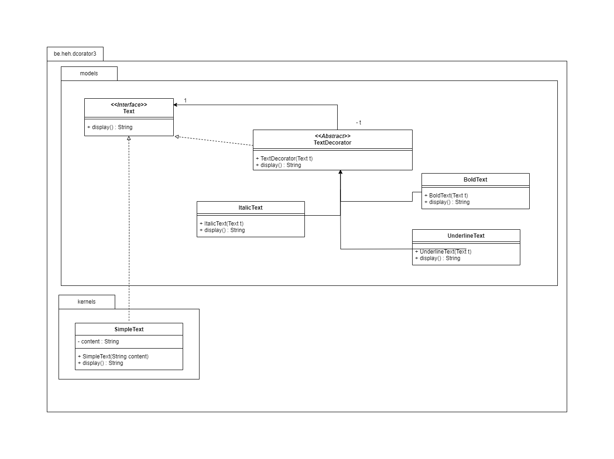

## Exercice 3 : Gestion de textes avec mise en forme
Vous devez concevoir un système permettant d’ajouter dynamiquement des styles à un texte
(gras, italique, souligné, etc.).

Réalisé par Evard Kyllian.

